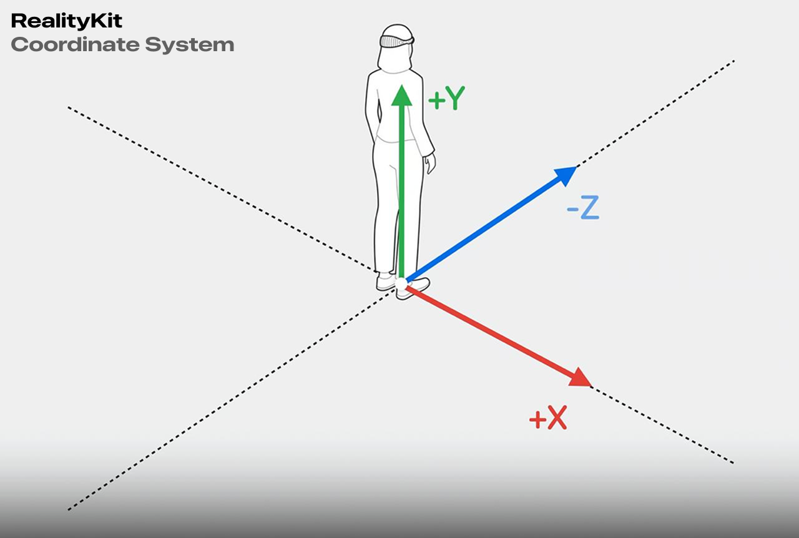

# RoboKit Documentation

## Overview
**RoboKit** is a framework designed to faciliate the integration between visionOS applications and robotics software.

## Requirements
- visionOS 2.0+
- XCode

## Installation
To install RoboKit using [Swift Package Manager](https://github.com/apple/swift-package-manager), follow the [official tutorial by Apple](https://developer.apple.com/documentation/xcode/adding_package_dependencies_to_your_app) and use the URL for this repository:

1. In Xcode, select **File → Add Packages...**
2. Enter the following URL:
   ```
   https://github.com/Spacial-Dragons/RoboKit
   ```
3. Select the Dependency Rule as `Up to Next Major Version`
---

## Socket Module

### Description
The Socket module provides a pre-structured TCP socket that allows for communication between the visionOS application and the software that responsible for the robot.

### Setup Guide

#### 1. Initialize a client instance
- Intilize and assign a `TCPClient` instance to a variable, definiting its host and port:
```swift
var client: TCPClient = TCPClient(host: "localhost", port: 12345)
```
> [!NOTE]  
> The host and port assigned to the client should be those of the server that you desire to reach.  

---

## Image Tracker Module

### Description
The Image Tracker module provides functionality for detecting and tracking images in the physical environment using ARKit and visionOS.

### Setup Guide

#### 1. Configure Permissions
Add the following entry in your `Info.plist` to request world-sensing permission:

```xml
<key>NSWorldSensingUsageDescription</key>
<string>This app requires world sensing capabilities to track reference images.</string>
```

#### 2. Create AR Reference Image Group
- Open Xcode.
- Add an **AR Resource Group** in `xcassets`.
- Name the group (e.g., `"AR Resources"`).
- Add reference images for tracking and set their **physical size**.

#### 3. Define Tracking Images in Code
Each reference image must include:
- `imageName`: The name of the image in `xcassets`.
- `rootOffset`: The offset (in meters) from the intended physical root point. The offset should be represented in RealityKit coordinate system.

Example:

```swift
import RoboKit

let trackingImages: [TrackingImage] = [
    TrackingImage(imageName: "TrackingImage-1", rootOffset: .init(x: -0.1135, y: 0, z: 0.175)),
    TrackingImage(imageName: "TrackingImage-2", rootOffset: .init(x: 0.1135, y: 0, z: -0.175))
]
```




> [!IMPORTANT]  
> **Tracking image quality is critical.**  
> - Avoid images with **heavy compression**, as it interferes with feature extraction.  
> - Avoid images with **too many or too few geometric features** (e.g., barcodes, QR codes, logos, and line art), as they result in poor detection and tracking performance.  
> - Avoid images with **repeating patterns**, as they can cause detection and tracking issues.

> [!IMPORTANT]  
> All tracking images must share the **same physical orientation** (e.g., all upright or all rotated the same way).  
> Inconsistent orientations can lead to incorrect spatial calculations and tracking issues.  

> [!NOTE]  
> If multiple images are provided, the framework **computes the center** using their `rootOffset` values.  
> If only **one** image is used, set its `rootOffset = .zero` to make it the reference point.  


#### 4. Initialize `ImageTracker`
After defining the reference images, initialize the `ImageTracker` class by providing the `arResourceGroupName` and the array of images:

```swift
@State private var imageTracker: RoboKit.ImageTracker = .init(
    arResourceGroupName: "AR Resources",
    images: trackingImages
)
```

### Usage
The `ImageTracker` exposes two key properties:

#### `rootTransform`
A `simd_float4x4?` transform matrix representing the center point between all tracked images, based on their `rootOffset` values.

Basic usage:
```swift
.onChange(of: imageTracker.rootTransform) {
    print(imageTracker.rootTransform)
}
```

#### `trackedImagesTransform`
An array of `simd_float4x4` matrices representing the individual positions of each tracked image in RealityKit space.

Basic usage:
```swift
.onChange(of: imageTracker.trackedImagesTransform) {
    print(imageTracker.trackedImagesTransform)
}
```

> [!NOTE]  
> `rootTransform` and `trackedImagesTransform` will be updated **only once in a while** (approximately every second) due to ARKit limitations.  
> This behavior **cannot** be modified.

> [!WARNING]  
> Image tracking is **not supported** in the simulator. Both `rootTransform` and `trackedImagesTransform` will return emulated values.

> [!IMPORTANT]  
> On visionOS, ARKit currently supports tracking **only one image at a time**, even if multiple reference images are visible.  
> This is **expected behavior** and should be considered when designing experiences that rely on simultaneous image tracking.  

---

## API Reference

### `TrackingImage`
Represents a tracking image and its associated metadata, such as its name in the asset catalog and its physical offset.

#### Properties

##### `imageName`
```swift
let imageName: String
```
- Name of the image in the asset catalog.
- Must exactly match the name in `.xcassets`.

##### `rootOffset`
```swift
let rootOffset: SIMD3<Float>
```
- Physical offset in meters from the root reference point.
- Follows RealityKit's coordinate system.
- Example: `SIMD3<Float>(0.125, 0, 0)` represents a 12.5 cm offset on the X-axis.

#### Initializer
```swift
public init(imageName: String, rootOffset: SIMD3<Float>)
```
- `imageName`: Name in the asset catalog.
- `rootOffset`: Physical offset in meters.

Example:
```swift
let trackingImage = TrackingImage(
    imageName: "TrackingImage",
    rootOffset: .init(x: -0.1135, y: 0, z: 0.175)
)
```

---

### `ImageTracker`
Handles detection and tracking of images via ARKit. Provides transformation data for detected images and computes a central root point.

#### Properties

##### `rootTransform`
```swift
public var rootTransform: simd_float4x4?
```
- Transformation matrix of the root point.
- Returns `nil` if no reference is detected.

##### `trackedImagesTransform`
```swift
public var trackedImagesTransform: [simd_float4x4]
```
- Transformation matrices for all tracked images.

#### Initializer
```swift
public init(arResourceGroupName: String, images: [TrackingImage])
```
- `arResourceGroupName`: Name of the AR Resource Group in the asset catalog.
- `images`: Array of `TrackingImage` instances.

Example:
```swift
let tracker = ImageTracker(
    arResourceGroupName: "AR Resources",
    images: [
        TrackingImage(imageName: "TrackingImage-1", rootOffset: SIMD3<Float>(0, 0, 0)),
        TrackingImage(imageName: "TrackingImage-2", rootOffset: SIMD3<Float>(0.1, 0, 0))
    ]
)
```

---

## Demo project
For advanced usage examples, refer to the [Demo project](https://github.com/Spacial-Dragons/RoboKit-Demo) demonstrating the capabilities of the `ImageTracker` module.
